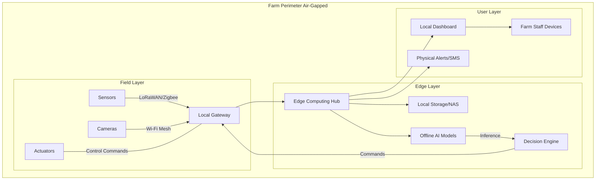

```mermaid
flowchart TD
    subgraph Farm Perimeter Air-Gapped
        subgraph Field Layer
            A1[Sensors] -->|LoRaWAN/Zigbee| B1[Local Gateway]
            A2[Cameras] -->|Wi-Fi Mesh| B1
            A3[Actuators] <---|Control Commands| B1
        end
        
        subgraph Edge Layer
            B1 --> C1[Edge Computing Hub]
            C1 --> D1[Local Storage/NAS]
            C1 --> E1[Offline AI Models]
            E1 -->|Inference| F1[Decision Engine]
            F1 -->|Commands| B1
        end
        
        subgraph User Layer
            C1 --> G1[Local Dashboard]
            C1 --> H1[Physical Alerts/SMS]
            G1 --> I1[Farm Staff Devices]
        end
    end
```
